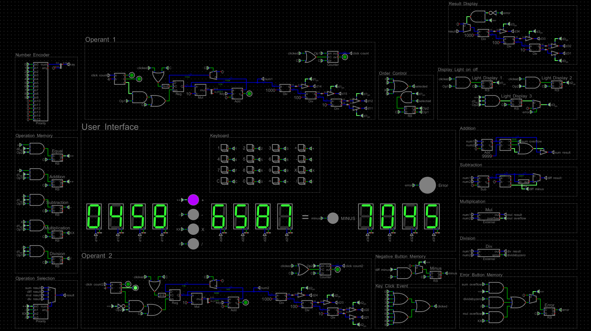

# Digital Calculator

## About the Project
This project is a **digital design** study. The goal is to design and simulate a simplified electronic calculator capable of performing 4 arithmetic operations (addition, subtraction, multiplication, and division) with operands limited to 4-digit decimal integers. The project incorporates digital design components such as a 7-segment hex display, registers, RS latches, multiplexers, priority encodes, three-state buffers and numerous logic gates.

## Requirements
To run the project, the following software must be installed:

1. **Digital** program:
   - Download link: [Digital by hneemann](https://github.com/hneemann/Digital)
   - This program is used for designing and simulating digital circuits.

2. **Icarus Verilog**:
   - Download link: [Icarus Verilog](https://bleyer.org/icarus/)
   - Required for compiling and simulating Verilog code.

## Features
- **Arithmetic Operations**: Supports addition, subtraction, multiplication, and integer division.
- **Operand Limits**: Operands are limited to 4-digit positive decimal integers (0 to 9999).
- **Error Handling**: Handles divide-by-zero and overflow errors with appropriate indicators.
- **Reset Functionality**: A reset button (C) clears the current operation and returns the calculator to its initial state.

- **Clocking Mechanism**: This design does not use a universal clock. Instead, it operates in an event-driven manner, where the circuit is triggered and processes data only when a key is pressed.

## Installation and Usage
1. Download and install the required software from the links above.
2. Clone or download the project files to your computer.
3. Open and simulate the circuit using the Digital program.
4. Add the path of Icarus Verilog to Digital's Settings/Advanced/IVerilog similar to this: C:\iverilog\bin\iverilog.exe
5. You are ready to simulate the calculator.

## License
This project is open-source and subject to the relevant license terms.